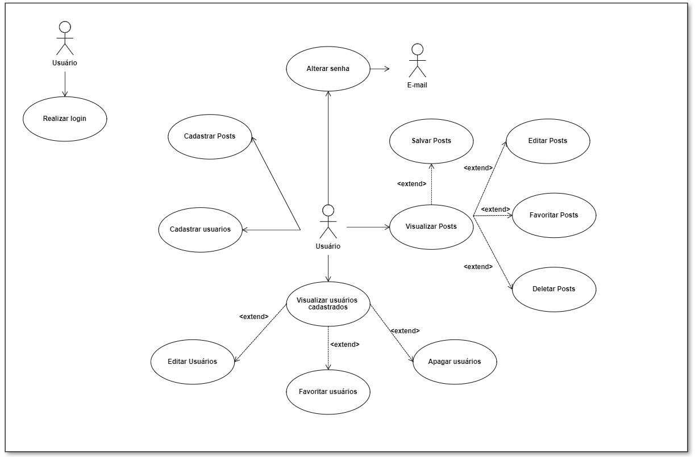

# Casos de Uso

## Identificação dos Atores

Ator | Nome | Descrição
---- | ---- | ---------
01 | Usuário | Usuário habilitado a cadastrar usuários e gerenciar posts pelo sistema
02 | Email | Sistema externo habilitado via autenticação de token a prover a recuperação de senha

## Identificação dos Casos de Uso

UC | Nome do UC |
-- | ---------- |
UC-01 |Realizar Login
UC-02 | Alterar senha
UC-03 | Cadastrar usuários
UC-04 | Cadastrar Posts
UC-05 | Visualizar usuários cadastrados
UC-06 | Editar usuários
UC-07 | Favoritar usuários
UC-08 | Apagar usuários
UC-09 | Visualizar Posts
UC-10 | Editar Posts
UC-11 | Deletar Posts
UC-12 | Favoritar Posts
UC-13 | Salvar Posts

## Diagrama de Casos de Uso

## Especificação dos Casos de Uso

### Histórico de Revisão

Data | Versão | Descrição | Autor
---- | ------ | --------- | -----
29/01 | 1.0 | Descrição dos Casos de Uso | Gian, Giulia, Helder, Júlio, Silas
30/01 | 1.1 | Fluxos Básicos, Alternativos e de Exceção | Gian, Giulia, Helder, Júlio, Silas
02/02 | 1.2 | Atualização do Documento | Gian, Giulia, Helder, Júlio, Silas
03/02 | 1.3 | Atualização do Documento | Gian, Giulia, Helder, Júlio, Silas

### Caso de Uso:  UC-01 x Realizar Login
#### Por: Silas Neres - 20/0043536
Descrição: Caso de Uso: UC-01 Realizar Login:

* Atores: Usuário
* Pré-Condições: O ator deve estar cadastrado no sistema.
* Pós-Condições: O ator fica habilitado a realizar ações de modificações nas respostas atualizadas em sua própria área de respostas do sistema.
* Requisitos Funcionais: 

Épico | Feature | US | Descrição 
----- | ------- | -- | ---------
03 | 08 | 26 | Eu como usuário gostaria de realizar login com email e senha para adentrar no sistema

* Requisitos Não-Funcionais:

URPS+ | ID | Descrição 
----- | -- | ---------
INTERFACE | RN4 | O sistema deve ser web
IMPLEMENTAÇÃO | RN5 | O sistema deve assegurar os dados do usuário com autenticação Auth Guard e JWT.
RESTRIÇÃO DE DESIGN | RN7 | A interface do sistema deve seguir a paleta de verde, azul e branco e possuir um modo dark, com um estilo mais minimalista

#### Fluxo Básico: Login autenticado
1. O caso de uso se inicia quando o ator acessa a tela de login.
2. O sistema solicita as informações para login.
3. O ator informa seu email e sua senha.
4. O sistema valida as credenciais do usuário.
5. O sistema informa que a autenticação foi realizada com sucesso
6. O caso de uso se encerra

#### Fluxo de Exceção A: Usuário não cadastrado
 - No passo 3, se o ator não estiver cadastrado:
1. O sistema não valida as credenciais do usuário.
2. O sistema informa que o ator não está cadastrado
3. O fluxo retorna para o passo 2 do fluxo base

#### Fluxo de Exceção B: Informações incorretas
 - No passo 3, caso as credenciais estejam incorretas.
1. O sistema não valida as credenciais do usuário.
2. O sistema informa que o email ou a senha está incorreta
3.  O fluxo retorna para o passo 2 do fluxo base

### Caso de Uso:  UC-02 x Alterar Senha
#### Por: Júlio César - 19/0015721

Descrição: Caso de Uso: UC-02 Alterar Senha: Este caso de uso especifica que o ator altere sua senha cadastrada. Apenas usuários cadastrados podem recuperar sua senha. Para alterar a senha,  o usuário receberá um email com link para alterar a senha, a fim de confirmar sua identidade. 
* Atores: Usuário, Email
* Pré-Condições: O ator Professor-Aluno deve estar cadastrado no sistema. 
* Pós-Condições: O ator Professor-Aluno deverá ser autenticado com a nova senha cadastrada.
* Requisitos Funcionais: 

Épico | Feature | US | Descrição 
----- | ------- | -- | ---------
03 | 08 | 27 | Eu como usuário gostaria de ter a possibilidade de recuperar minha senha através do email caso eu a esqueça

* Requisitos Não-Funcionais:

URPS+ | ID | Descrição 
----- | -- | ---------
INTERFACE | RN4 | O sistema deve ser web
IMPLEMENTAÇÃO | RN5 | O sistema deve assegurar os dados do usuário com autenticação Auth Guard e JWT.
RESTRIÇÃO DE DESIGN | RN7 | A interface do sistema deve seguir a paleta de verde, azul e branco e possuir um modo dark, com um estilo mais minimalista

#### Fluxo Básico: Alterar a senha
1. O caso de uso se inicia quando o ator Usuário escolhe a opção “esqueceu a senha?”.
2. O sistema solicita o email cadastrado.
3. O ator informa as informações necessárias
4. O sistema valida o email digitado.
5. O ator Email recebe o token para a alteração da senha
6. O ator Email envia para o ator Usuário um email para a alteração da senha
7. O ator Professor-Aluno acessa seu e-mail cadastrado e clica no link para alterar a senha.
8. O ator Professor-Aluno informa a nova senha
9. O sistema retorna a pagina de login
10. O caso de uso se encerra.

#### Fluxo de Exceção: Validação de E-mail
 - No passo 4, caso o e-mail digitado esteja incorreto:
1. O sistema informa uma mensagem de erro
2. O fluxo retorna ao passo 2 do fluxo básico.

### Caso de Uso:  UC-04 x Cadastrar Usuários
#### Por: Gian Medeiros - 19/0055006

Descrição: Caso de Uso: UC-03 Cadastrar Usuários: Este caso de uso especifica o cadastro de usuários no sistema, a partir de dados recebidos do ator. O sistema deve tratar esses dados e possibilitar acesso ao ator a partir do US de login.

* Atores: Usuário
* Pré-Condições: O ator precisa possuir um email válido
* Pós-Condições: O ator fica habilitado a realizar o login na aplicação
* Requisitos Funcionais: 

Épico | Feature | US | Descrição 
	INTERFACE | RN4 | O sistema deve ser web
IMPLEMENTAÇÃO | RN5 | O sistema deve assegurar os dados do usuário com autenticação Auth Guard e JWT.
RESTRIÇÃO DE DESIGN | RN7 | A interface do sistema deve seguir a paleta de verde, azul e branco e possuir um modo dark, com um estilo mais minimalista

#### Fluxo Básico: Cadastro de usuário desejado
1. O ator decide se cadastrar.
2. O sistema apresenta as informações necessárias para realizar o cadastro (Nome completo, curso, matrícula, celular, email e senha).
3. O ator informa os dados solicitados.
4. O sistema vai para a página de login
5. O caso de uso se encerra.

#### Fluxo de Exceção: Dados incorretos
 - No passo 3, caso o ator passe os dados em formato incorreto:
1. O sistema exibe uma mensagem de erro
2. O fluxo retorna ao passo 2 do fluxo básico.

#### Fluxo de Exceção: Dados incompletos
 - No passo 3, caso o ator não passe todos dados obrigatórios necessários:
1. O sistema exibe uma mensagem de erro
2. O fluxo retorna ao passo 2 do fluxo básico.

#### Fluxo de Exceção:  E-mail já cadastrado
 - No passo 3, caso o ator passe um e-mail já cadastrado:
1. O sistema exibe uma mensagem de e-mail já cadastrado
2. O fluxo retorna ao passo 2 do fluxo básico

### Caso de Uso:  UC-05 x Visualizar Usuários Cadastrados
#### Por: Giulia Alcantara - 18/0121308

Descrição: Caso de Uso: UC-04 Visualizar Usuários Cadastradosos: Este caso de uso especifica a ação de visualização de um usuário cadastrado no sistema. Apenas usuários cadastrados podem visualizar outros usuários cadastrados no sistema. O usuário pode buscar outro e, a partir disso, então visualizar seu perfil ou de terceiros. Após a validação no sistema, o usuário torna-se apto a realizar as operações da sua área restrita.

* Atores: Usuário
* Pré-Condições: O ator deve estar cadastrado no sistema; O ator deve estar logado com autenticação no sistema.
* Pós-Condições: O ator fica habilitado a realizar ações referentes aos usuários desejados em sua própria área do sistema.
* Requisitos Funcionais: 

Épico | Feature | US | Descrição 
----- | ------- | -- | ---------
02 | 04 | 14 | Eu como usuário gostaria de visualizar a minha posição no ranking geral para fins de melhorá-la
03 | 08 | 22 | Eu como usuário gostaria de visualizar os meus dados cadastrais em uma aba de perfil para poder conferir se as informações estão corretas
03 | 08 | 23 | Eu como usuário gostaria de ter a possibilidade de buscar outros usuários para poder averiguar as perguntas que um usuário já fez

* Requisitos Não-Funcionais:

URPS+ | ID | Descrição 
----- | -- | ---------
INTERFACE | RN4 | O sistema deve ser web
IMPLEMENTAÇÃO | RN5 | O sistema deve assegurar os dados do usuário com autenticação Auth Guard e JWT.
RESTRIÇÃO DE DESIGN | RN7 | A interface do sistema deve seguir a paleta de verde, azul e branco e possuir um modo dark, com um estilo mais minimalista

##### Fluxo Básico: Visualização de um usuário desejado
1. O caso de uso é iniciado ator decide buscar um usuário
2. O sistema solicita o e-mail do usuário desejado
3. O ator informa o e-mail do usuário que deseja buscar
4. O sistema disponibiliza os resultados correspondentes a busca
5. O ator seleciona o usuário desejado
6. O sistema exibe o perfil do usuário desejado
7.  O caso de uso se encerra.

##### Fluxo de Exceção:
  - No passo 3, caso o e-mail fornecido esteja incorreto:
1. O sistema exibe a ausência de resultados na busca
2. O fluxo retorna ao passo 2 do fluxo básico.

### Caso de Uso:  UC-04 x Cadastrar posts
#### Por: Helder Lourenço - 18/0121847
Descrição: Caso de Uso: UC-10 Cadastrar posts: Este caso de uso especifica a ação de controle que um usuário executa no sistema, com objetivo de cadastrar posts. Apenas usuários logados podem cadastrar posts no sistema. O usuário pode selecionar "cadastrar post" e, a partir delas, gerenciar seus respectivos posts. Após a validação no sistema, o usuário torna-se apto a realizar as operações da sua área restrita.

* Atores: Usuário
* Pré-Condições: O ator deve estar cadastrado no sistema; O ator deve estar logado com autenticação no sistema.
* Pós-Condições: O ator fica habilitado a realizar ações de modificações nosposts atualizadas em sua própria área de posts do sistema.
* Requisitos Funcionais: 

Épico | Feature | US | Descrição 
----- | ------- | -- | ---------
01 | 01 | 01 | Eu, como usuário, gostaria de cadastrar avisos para informar notícias de acontecimentos como monitorias

* Requisitos Não-Funcionais:

URPS+ | ID | Descrição 
----- | -- | ---------
INTERFACE | RN4 | O sistema deve ser web
RESTRIÇÃO DE DESIGN | RN7 | A interface do sistema deve seguir a paleta de verde, azul e branco e possuir um modo dark, com um estilo mais minimalista

##### Fluxo Básico: Cadastrar perguntas
1. O caso de uso se inicia quando o ator seleciona cadastrar pergunta
2. O sistema solicita as informações para a pergunta
3. O ator informa os dados da pergunta 
5. O ator salva a pergunta feita
6. O caso de uso encerra

#### Fluxo de Exceção:
 - No passo 3 caso os dados da pergunta não estejam corretos:
 1. O sistema exibe uma mensagem de erro
 2. O fluxo retorna para o passo 2 do fluxo base

### Informações adicionais
* Referência: https://www.ic.unicamp.br/~ariadne/mc436/1s2013/Modelo_doc_casos_uso.pdf
* Projeto:  https://mdsreq-fga-unb.github.io/2022.2-Dubium/mvps/
* UML: https://cacoo.com/diagrams/zwI6C1sAFXKATlM0/5ADCD
