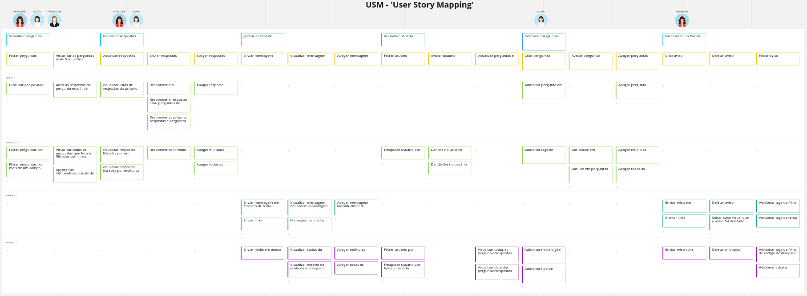
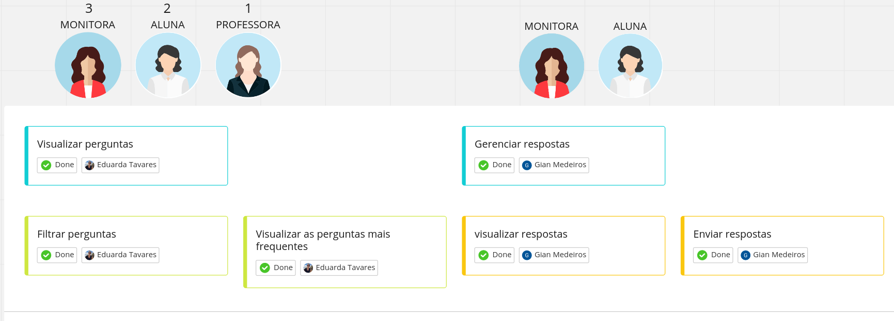
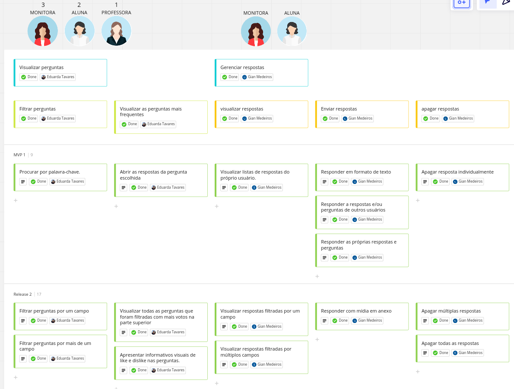

# USM Canvas

Link de acesso ao miro: <https://miro.com/app/board/uXjVP33_snA=/?share_link_id=676890663709>

<iframe width="768" height="432" src="https://miro.com/app/board/uXjVP33_snA=/?share_link_id=721105816862" frameborder="0" scrolling="no" allowfullscreen></iframe>

# User Story Mapping

## **Personas:**

1 - Professora

2 - Aluna

3 - Monitora

## **Objetivos:**

### Personas 1 + 2 + 3:

- Visualizar perguntas

### Personas 2 + 3:

- Gerenciar respostas
- Gerenciar chat de conversa
- Visualizar usuário

### Persona 2:

- Gerenciar perguntas

### Persona 3:

- Fazer aviso no fórum de monitoria

## **atividades:**

### Visualizar perguntas:

- Filtrar perguntas
- visualizar as perguntas mais frequentes

### Gerenciar respostas:

- Visualizar respostas
- Enviar respostas
- Apagar respostas

### Gerenciar chat de conversa:

- Enviar mensagem
- Visualizar mensagem
- Apagar mensagem

### Visualizar usuário:

- Filtrar usuário
- Avaliar usuário
- Visualizar perguntas e respostas

### Gerenciar perguntas:

- Criar perguntas
- Avaliar perguntas
- Apagar perguntas

### Fazer aviso no fórum de monitoria:

- Criar aviso
- Deletar aviso
- Filtrar aviso

## **User Storys:**

### **Filtrar perguntas**

* **Procurar por palavra-chave**
    - **Eu como** usuário **quero** poder filtrar perguntas por palavras-chave **para** que eu possa encontrar perguntas mais facilmente.

* **Filtrar perguntas por um campo**
    - **Eu como** usuário **quero** poder filtrar perguntas por um determinado campo **para** que eu possa encontrar perguntas de um tema específico.

* **Filtrar perguntas por mais de um campo**
    - **Eu como** usuário **quero** poder filtrar perguntas por mais de um campo **para** poder realizar buscas por temas relacionados.

### **Visualizar as perguntas mais frequentes**

* **Abrir as respostas da pergunta escolhida**
    - **Eu como** usuário **quero** poder selecionar uma pergunta dentre a lista visualizada **para** obter mais dados sobre a mesma.

* **Visualizar todas as perguntas que foram filtradas com mais votos na parte superior**
    - **Eu como** usuário **quero** poder visualizar uma lista de perguntas que foram filtradas onde as perguntas de maior quantidade de votos positivos estejam na parte superior da lista **para** que seja possível identificar as perguntas de maior importância.

* **Visualizar todas as perguntas que foram filtradas com mais votos na parte superior**
    - **Eu como** usuário **quero** poder visualizar uma lista de perguntas que foram filtradas onde as perguntas de maior quantidade de votos positivos estejam na parte superior da lista **para** que seja possível identificar as perguntas de maior importância.

* **Apresentar informativos visuais de like e dislike nas perguntas**
    - **Eu como** usuário **quero** poder visualizar a quantidade de likes (votos positivos) e dislikes (votos negativos) das perguntas **para** que eu possa saber a avaliação de outros usuários sobre as perguntas sem que tenha que seleciona-las antes.

### **Visualizar respostas**

- **Visualizar listas de respostas do próprio usuário**
    - **Eu como** monitora e/ou aluna **quero** poder visualizar minhas próprias respostas **para** que eu possa ver se houve alguma atualização, como votos, respostas ou para me relembrar da mesma.

- **Visualizar respostas filtradas por um campo**
    - **Eu como** monitora e/ou aluna **quero** poder filtrar minhas respostas por um determinado campo **para** que eu possa encontrar determinada pergunta mais facilmente.

- **Visualizar respostas filtradas por múltiplos campos**
    - **Eu como** monitora e/ou aluna **quero** poder visualizar minhas respostas filtrando por múltiplos campos **para** que eu possa encontrar mais facilmente resposta de temas correlatos.

### **Responder**

- **Responder em formato de texto**
    - **Eu como** monitora e/ou aluna **quero** poder responder perguntas em formato de texto **para** que eu possa ajudar outros usuários nos seus questionamentos de forma textual.

- **Responder a respostas e/ou perguntas de outros usuários**
    - **Eu como** monitora e/ou aluna **quero** poder responder a perguntas e/ou respostas de outros usuários **para** que eu possa responder duvidas de outros usuários.

- **Responder as próprias respostas e perguntas**
    - **Eu como** monitora e/ou aluna **quero** poder responder as minhas próprias perguntas e/ou respostas **para** que eu possa adicionar mais informações ou fazer ressalvas sobre algo que já foi dito.

- **Responder com mídia em anexo**
    - **Eu como** monitora e/ou aluna **quero** poder anexar conteúdos de mídia dentro de uma resposta para que eu consiga enviar mídias como fotos de resoluções **para** auxiliar no entendimento da resposta.

### **Apagar respostas**

- **Apagar resposta individualmente**
    - **Eu como** monitora e/ou aluna **quero** poder apagar individualmente alguma resposta **para** que eu possa remover respostas com algum erro. 

- **Apagar múltiplas respostas**
    - **Eu como** monitora e/ou aluna **quero** poder apagar múltiplas respostas simultaneamente **para** que possa apagar varias respostas de forma simultânea.

- **Apagar todas as respostas**
    - **Eu como** monitora e/ou aluna **quero** poder apagar todas as respostas de uma única ação **para** que não seja necessário selecionar todos os itens para a exclusão.

### **Enviar mensagem**

- **Enviar mensagem em formato de texto**
    - **Eu como** monitora e/ou aluna **quero** poder enviar mensagens em formato de texto **para** poder entrar em contato com outros usuários.

- Enviar links**
    - **Eu como** monitora e/ou aluna **quero** poder enviar links por mensagem **para** que eu possa referenciar outros sites de forma mais direta.

- **Enviar mídia em anexo**
    - **Eu como** monitora e/ou aluna **quero** poder enviar enviar conteúdos de mídia em anexo da mensagem **para** que eu possa facilitar o compartilhamento de mídias que auxiliem na comunicação

### **Visualizar mensagem**

- **visualizar mensagem em ordem cronológica**
    - **Eu como** monitora e/ou aluna **quero** poder visualizar as mensagens em ordem cronológica **para** que facilitar o seu entendimento.

- **Mensagem em lados opostos**
    - **Eu como** monitora e/ou aluna **quero** poder visualizar minhas mensagens no lado direito da tela e visualizar as mensagens do outro usuário a esquerda **para** que as mensagens estejam separadas visualmente.

- **Visualizar status da mensagem**
    - **Eu como** monitora e/ou aluna **quero** poder visualizar o status da mensagem (enviada e recebida) **para** que eu saiba se a mensagem foi enviada e/ou recebida com sucesso.

- **Visualizar horário de envio da mensagem**
    - **Eu como** monitora e/ou aluna **quero** poder visualizar o horário de envio da mensagem **para** que eu possa saber o horário de envio de mensagens antigas. 

### **Apagar mensagem**

- **Apagar mensagem individualmente**
    - **Eu como** monitora e/ou aluna **quero** poder apagar uma determinada mensagem **para** que eu possa apagar mensagens com algum erro.

- **Apagar múltiplas mensagens**
    - **Eu como** monitora e/ou aluna **quero** poder apagar múltiplas perguntas simultaneamente **para** que possa apagar varias mensagens de forma simultânea.

- **Apagar todas as mensagens**
    - **Eu como** monitora e/ou aluna **quero** poder apagar todas as mensagens de uma única ação **para** que não seja necessário selecionar todos os itens para a exclusão.

### **Filtrar usuário**

- **Pesquisar usuário por nome**
    - **Eu como** monitora e/ou aluna **quero** poder pesquisar usuários pelo nome **para** que eu possa encontrar outros usuários mais facilmente.

- **Filtrar usuário por semestre**
    - **Eu como** monitora e/ou aluna **quero** poder filtrar usuários por número de semestre **para** que eu possa encontrar usuários por faixas de semestre.

- **Pesquisar usuário por tipo de usuário**
    - **Eu como** aluna e/ou monitora **quero** poder filtrar usuários pelo tipo de usuário (aluno, professor, monitor, secretaria) **para** que eu possa encontrar professores e monitores e outros usuários de forma simples.

### **Avaliar usuário**

- **Dar like no usuário**
    - **Eu como** aluna e/ou monitora **quero** poder dar um like em determinado usuário **para** poder avaliar positivamente um usuário que ofereceu ajuda de forma positiva.

- **Dar dislike no usuário**
    - **Eu como** aluna e/ou monitora **quero** poder dar um dislike em determinado usuário **para** poder avaliar negativamente um usuário que ofereceu ajuda de forma negativa.

### **Visualizar perguntas e respostas**

- **Visualizar todas as perguntas/respostas do usuário**
    - **Eu como** aluna e/ou monitora **quero** poder visualizar todas as perguntas e respostas de um determinado usuário **para** que eu possa encontrar mais perguntas e resposta de um determinado usuário.

- **Visualizar data das perguntas/respostas**
    - **Eu como** aluna e/ou monitora **quero** poder visualizar a data de publicação das perguntas e respostas **para** que eu possa saber o qual atualizada estão tais questionamentos e respostas.

### **Criar perguntas**

- **Adicionar pergunta em formato de texto**
    - **Eu como** aluna **quero** poder adicionar perguntas em formato de texto **para** que eu possa tiver minhas dúvidas.

- **Adicionar tags de filtros**
    - **Eu como** aluna **quero** poder adicionar tags de filtro em minhas perguntas **para** que minha pergunta se enquadre no grupo correto.

- **Adicionar mídia digital em anexo da pergunta**
    - **Eu como** aluna **quero** poder adicionar mídia digital às perguntas **para** que eu possa expressar melhor minhas dúvidas.

- **Adicionar tipo de dificuldade da pergunta**
    - **Eu como** aluna **quero** poder adicionar um nível de dificuldade referente à minha pergunta **para** eu possa expressar a dificuldade para responder à pergunta.

### **Avaliar perguntas**

- **Dar like em perguntas**
    - **Eu como** aluna **quero** poder dar um dislike em determinado pergunta **para** poder avaliar negativamente uma pergunta que esteja errada ou que seja anti-ético.

- **Dar deslike em perguntas**
    - **Eu como** aluna **quero** poder dar um like em determinada pergunta **para** poder avaliar positivamente uma pergunta me ajudou ou que eu gostasse de dar mais destaque.

### **Apagar perguntas**

- **Apagar pergunta individualmente**
    - **Eu como** aluna **quero** poder apagar individualmente alguma pergunta **para** que eu possa remover perguntas que eu deseje apagar.

- **Apagar múltiplas perguntas**
    - **Eu como** aluna **quero** poder apagar múltiplas perguntas simultaneamente **para** que possa apagar varias perguntas de forma simultânea sem necessidade de remove-las individualmente.

- **Apagar todas as perguntas**
    - **Eu como** aluna **quero** poder apagar todas as mensagens **para** que possa apagar todas as perguntas sem ser necessário selecioná-las

### **Criar aviso**

- **Enviar aviso em formato de texto**
    - **Eu como** **quero** poder enviar avisos de momentos de monitoria **para** que uma grande parte dos alunos consigam ver os avisos.

- **Anexar links**
    - **Eu como** monitora **quero** poder anexar links diversos no corpo dos avisos **para** que links de reunião e calendários sejam acessado mais facilmente.

- **Enviar aviso com tabela de horários**
    - **Eu como** monitora **quero** poder enviar minha tabela de horários no aviso **para** facilitar em encontrar horários em comum.

### **Deletar aviso**

- **Deletar aviso individualmente**
    - **Eu como** monitora **quero** poder deletar de forma individual meu avisos **para** que eu possa remover avisos antigos ou com falhas.

- **Soltar aviso visual que o aviso foi deletado**
    - **Eu como** monitora **quero** poder receber alguma confirmação de que meu aviso foi removido **para** que eu possa ter certeza que o aviso foi deletado corretamente.

- **Deletar múltiplos avisos**
    - **Eu como** monitora **quero** poder deletar de forma múltipla meus avisos **para** que eu possa remover avisos antigos e/ou com falhas.

### **Filtrar aviso**

- **Adicionar tags de filtro de disciplina**
    - **Eu como** monitora **quero** poder adicionar tags de filtro referentes a disciplinas nos meus avisos **para** que outros usuários possam encontra-los com mais facilidade.

- **Adicionar tags de filtro de tema**
    - **Eu como** monitora **quero** poder adicionar tags de filtro referentes a temas nos meus avisos **para** que outros usuários possam encontra-los com mais facilidade.

- **Adicionar tags de filtro de código de disciplina**
    - **Eu como** monitora **quero** poder adicionar tags de filtro referentes aos códigos de disciplinas nos meus avisos **para** que outros usuários possam encontra-los com mais facilidade.

- **Adicionar aviso a grupos de usuários**
    - **Eu como** monitora **quero** poder adicionar tags de filtro referentes a grupos de usuários nos meus avisos **para** que outros usuários possam ser notificados de determinados avisos.

