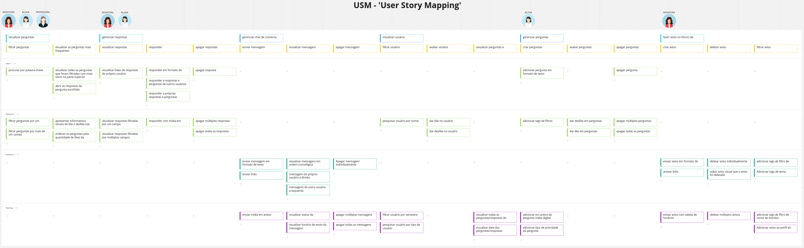

# USM - User Story Mapping

## **personas:**

1 - Professora

2 - Aluna

3 - Monitora

## **Objetivos:**

### personas 1 + 2 + 3:

- Visualizar perguntas

### personas 2 + 3:

- Gerenciar respostas
- gerenciar chat de conversa
- visualizar usuário

### persona 2:

- gerenciar perguntas

### persona 3:

- Fazer aviso no fórum de monitoria

## **atividades:**

### Visualizar perguntas:

- filtrar perguntas
- visualizar as perguntas mais frequentes

### Gerenciar respostas:

- visualizar respostas
- responder
- apagar respostas

### gerenciar chat de conversa:

- enviar mensagem
- visualizar mensagem
- apagar mensagem

### visualizar usuário:

- filtrar usuário
- avaliar usuário
- visualizar perguntas e respostas

### gerenciar perguntas:

- criar perguntas
- avaliar perguntas
- apagar perguntas

### Fazer aviso no fórum de monitoria:

- criar aviso
- deletar aviso
- filtrar aviso

## **User Storys:**

### **filtrar perguntas**

- procurar por palavra-chave
- filtrar perguntas por um campo
- filtrar perguntas por mais de um campo

### **visualizar as perguntas mais frequentes**

- visualizar todas as perguntas que foram filtradas com mais votos na parte superior
- apresentar informativos visuais de like e deslike nas perguntas
- ordenar as perguntas pela quantidade de likes da pergunta
- abrir as respostas da pergunta escolhida

### **visualizar respostas**

- visualizar listas de respostas do próprio usuário
- visualizar respostas filtradas por um campo
- visualizar respostas filtradas por múltiplos campos

### **responder**

- responder a respostas e perguntas de outros usuários
- responder a próprias respostas e perguntas
- responder em formato de texto
- responder com mídia em anexo

### **apagar respostas**

- apagar resposta individualmente
- apagar múltiplas respostas
- apagar todas as respostas

### **enviar mensagem**

- enviar mensagem em formato de texto
- enviar mídia em anexo
- enviar links

### **visualizar mensagem**

- visualizar mensagem em ordem cronológica
- mensagem do próprio usuário a direita
- mensagens do outro usuário a esquerda
- visualizar horário de envio da mensagem
- visualizar status da mensagem

### **apagar mensagem**

- apagar mensagem individualmente
- apagar múltiplas mensagens
- apagar todas as mensagens

### **filtrar usuário**

- pesquisar usuário por nome
- filtrar usuário por semestre
- pesquisar usuário por tipo de usuário

### **avaliar usuário**

- dar like no usuário
- dar dislike no usuário

### **visualizar perguntas e respostas**

- visualizar todas as perguntas/respostas do usuário
- visualizar data das perguntas/respostas

### **criar perguntas**

- adicionar pergunta em formato de texto
- adicionar em anexo da pergunta mídia digital
- adicionar tags de filtros
- adicionar tipo de prioridade da pergunta

### **avaliar perguntas**

- dar like em perguntas
- dar deslike em perguntas

### **apagar perguntas**

- apagar perguntas antigas
- apagar múltiplas perguntas
- apagar todas as perguntas

### **criar aviso**

- enviar aviso em formato de texto
- enviar aviso com tabela de horários
- anexar links

### **deletar aviso**

- deletar aviso individualmente
- deletar múltiplos avisos
- soltar aviso visual que o aviso foi deletado

### **filtrar aviso**

- adicionar tags de filtro de disciplina
- adicionar tags de filtro de nome de monitor
- adicionar tags de filtro de tema
- adicionar aviso ao perfil de usuário

## **Miro:**

link do USM no MIRO: [https://miro.com/app/board/uXjVP33_snA=/?share_link_id=880959747930](https://miro.com/app/board/uXjVP33_snA=/?share_link_id=880959747930)

